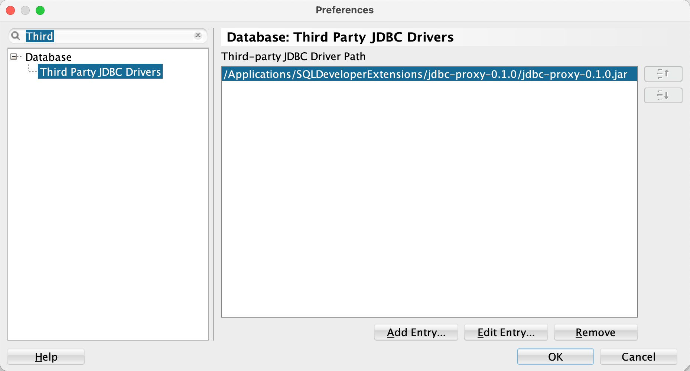
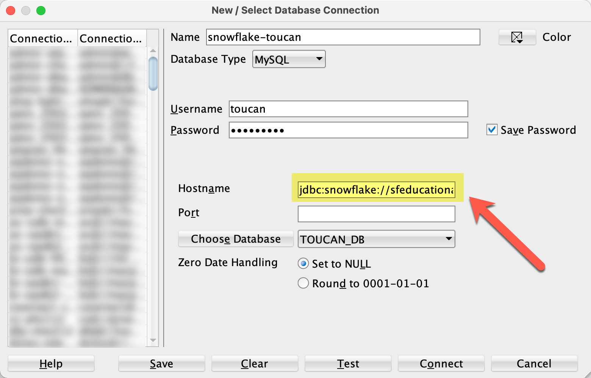

# JDBC Proxy for SQL Developer

## Introduction

This JDBC driver is mimicking a MySQL driver. As a result it can be configured as third party JDBC driver in [Oracle SQL Developer](https://www.oracle.com/database/technologies/appdev/sqldeveloper-landing.html) to access the following databases:

- [Snowflake](https://www.snowflake.com/)
- [PostgreSQL](https://www.postgresql.org/)
- [SQLite](https://www.sqlite.org/index.html)
- [H2](https://www.h2database.com/html/main.html)
- [MySQL](https://www.mysql.com/)

SQL Developer provides a reduced functionality for non Oracle Databases. This driver allows you to connect to these databases and use the features for MySQL within SQL Developer. 

## What Does the JDBC Proxy Besides Delegating Calls?

The proxy driver rewrites some SQL statements to the SQL dialect of the target database. This ensures that the statements executed during navigation in the Connections window are understood by the target driver, and a meaningful result is returned. 

The rewritten SQL is processed by the target JDBC driver, and the result is presented by SQL Developer which thinks it is talking to a MySQL database.

## Releases

Binary releases are published [here](https://github.com/Trivadis/sqldev-jdbc-proxy/releases).

## Installation

1. Download the driver (e.g. `jdbc-proxy-0.1.0.zip` from the [release page](https://github.com/Trivadis/sqldev-jdbc-proxy/releases))
2. Unzip the downloaded file in a folder of your choice
3. Register the `jdbc-proxy-0.1.0.jar` file in the "Third Party JDBC Drivers" section of the SQL Developer preferences as shown in the following screenshot

      

    Please ensure that the proxy driver is the first driver in the list. Restart SQL Developer, if you had to change the order of the JDBC drivers.

## Using the Driver

The full syntax of a JDBC URL supported by the JDBC proxy driver looks as follows:

```
jdbc:mysql:<target-jdbc-url>:[<port>]/[database]
```

This looks like a MySQL JDBC URL, because the proxy driver is mimicking a MySQL JDBC driver. However, the part which contains the `hostname` in a MySQL URL contains now a <target-jdbc-url>. This <target-jdbc-url> has to be entered in the "Hostname" field of the "New / Select Database Connection" dialog in SQL Developer.



Only the values for "Username", "Password" and "Hostname" are used to build the JDBC URL. Therefore, you have to provide everything you need as URL parameters. Here are some examples for "Hostname" values:

| Target Database | JDBC URL (in Hostname) | Notes |
| --------------- | ---------------------- | ----- |
| [Snowflake](https://docs.snowflake.com/en/user-guide/jdbc-configure.html#connection-parameters) | `jdbc:snowflake://<account>.snowflakecomputing.com:443/?db=toucan_db&warehouse=toucan_wh&schema=toucan_schema&role=training_role` | Properties `db`, `warehouse`, `schema` and `role` are set in the URL. |
| [PostgreSQL](https://jdbc.postgresql.org/documentation/head/connect.html) | `jdbc:postgresql://localhost:5432/postgres` | No additional properties configured. |
| [SQLite](https://github.com/xerial/sqlite-jdbc) | `jdbc:sqlite:/Users/phs/sqldev_sqlite.db` | No additional properties supported. |
| [H2](http://www.h2database.com/html/tutorial.html?highlight=JDBC_URL&search=jdbc#connecting_using_jdbc) | `jdbc:h2:/Users/phs/h2testphs` | No additional properties supported. |
| [MySQL](https://dev.mysql.com/doc/connector-j/8.0/en/connector-j-reference-configuration-properties.html) | `jdbc:mysql://localhost:3306/public?zeroDateTimeBehavior=CONVERT_TO_NULL` | Property `zeroDateTimeBehavior` is set in the URL. The default is EXCEPTION, which is overridden by SQL Developer. |

## Issues
Please file your bug reports, enhancement requests, questions and other support requests within [Github's issue tracker](https://help.github.com/articles/about-issues/).

* [Questions](https://github.com/Trivadis/sqldev-jdbc-proxy/issues?q=is%3Aissue+label%3Aquestion)
* [Open enhancements](https://github.com/Trivadis/sqldev-jdbc-proxy/issues?q=is%3Aopen+is%3Aissue+label%3Aenhancement)
* [Open bugs](https://github.com/Trivadis/sqldev-jdbc-proxy/issues?q=is%3Aopen+is%3Aissue+label%3Abug)
* [Submit new issue](https://github.com/Trivadis/sqldev-jdbc-proxy/issues/new)

## How to Contribute

1. Describe your idea by [submitting an issue](https://github.com/Trivadis/sqldev-jdbc-proxy/issues/new)
2. [Fork the utPLSQL-SQLDeveloper repository](https://github.com/Trivadis/sqldev-jdbc-proxy/fork)
3. [Create a branch](https://help.github.com/articles/creating-and-deleting-branches-within-your-repository/), commit and publish your changes and enhancements
4. [Create a pull request](https://help.github.com/articles/creating-a-pull-request/)

## How to Build

1. [Download](http://www.oracle.com/technetwork/developer-tools/sql-developer/downloads/index.html) and install SQL Developer 20.2.0
2. [Download](https://maven.apache.org/download.cgi) and install Apache Maven 3.6.3
3. [Download](https://git-scm.com/downloads) and install a git command line client
4. Clone this repository
5. Open a terminal window in the project's root folder and run the maven build:

   	mvn -Dsqldev.basedir=/Applications/SQLDeveloper20.2.0.app/Contents/Resources/sqldeveloper -DskipTests=true clean package

   Amend the parameter sqldev.basedir to match the path of your SQL Developer installation. This folder is used to reference Oracle jar files which are not available in public Maven repositories.
6. The resulting file ```jdbc-proxy-x.x.x-SNAPSHOT.zip``` in the ```target``` directory contains the proxy and all target JDBC drivers.

## License

JDBC Proxy for SQL Developer is licensed under the Apache License, Version 2.0. You may obtain a copy of the License at <http://www.apache.org/licenses/LICENSE-2.0>.
